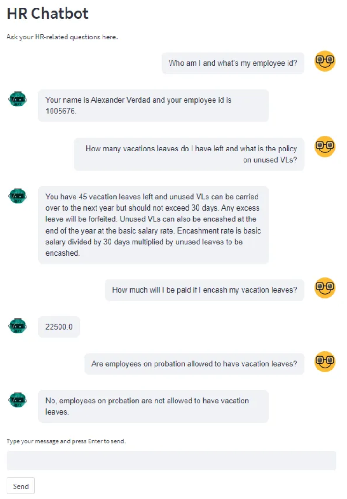
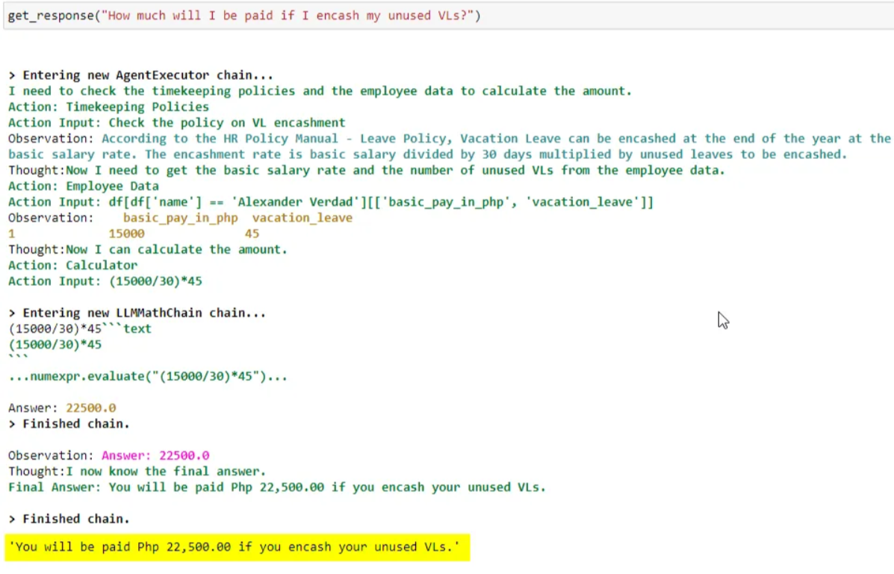

# Autonomous HR Chatbot built using ChatGPT, LangChain, Pinecone and Streamlit

Companion Reading: [Creating a (mostly) Autonomous HR Assistant with ChatGPT and LangChain’s Agents and Tools](https://medium.com/@stephen.bonifacio/creating-a-mostly-autonomous-hr-assistant-with-chatgpt-and-langchains-agents-and-tools-1cdda0aa70ef)

---
### TL;DR/Description
---
This is a prototype enterprise application - an autonomous agent that is able to answer HR queries using the tools it has on hand.
It was made using LangChain's agents and tools modules, using Pinecone as vector database and powered by ChatGPT or gpt-3.5-turbo. The front-end is Streamlit using the streamlit_chat component.

Tools currently assigned (with more on the way):
1. Timekeeping Policies - A ChatGPT generated sample HR policy document. Embeddings were created for this doc using OpenAI’s *text-embedding-ada-002* model and stored in a Pinecone index.
2. Employee Data - A csv file containing dummy employee data (e.g. name, supervisor, # of leaves etc). It's loaded as a pandas dataframe and manipulated by the LLM using LangChain's PythonAstREPLTool
3. Calculator - this is LangChain's calculator chain module, LLMMathChain

#### Sample Chat

#### Sample Tool Use

---
### Instructions
---

I made this prototype using Azure deployments as my company is an Azure customer.  
I created a backend file called 'hr_agent_backend_local.py' for those that does not want to use Azure.  
This is does not use any Azure components - the API is from platform.openai.com, the csv file is stored locally(i.e. on your own computer)

#### How to use this repo

1. Install python 3.10. [Windows](https://www.tomshardware.com/how-to/install-python-on-windows-10-and-11#:~:text=1.,and%20download%20the%20Windows%20installer.&text=2.,is%20added%20to%20your%20path.), [Mac](https://www.codingforentrepreneurs.com/guides/install-python-on-macos/) 
2. Clone the repo to a local directory.
3. Navigate to the local directory and run this command in your terminal to install all prerequisite modules - 'pip install -r requirements.txt'
4. Input your own API keys in the hr_agent_backend_local.py file (or hr_agent_backend_azure.py if you want to use the azure version; just uncomment it in the frontend.py file)
5. Run 'streamlit run hr_agent_frontent.py' in your terminal

#### Storing Embeddings in Pinecone

1. Create a Pinecone account in [pinecone.io](pinecone.io) - there is a free tier.  Take note of the Pinecone API and environment values.
2. Run the notebook 'store_embeddings_in_pinecone.ipynb'. Replace the Pinecone and OpenAI API keys (for  the embedding model) with your own.

---
### Tech Stack
---

[Azure OpenAI Service](https://azure.microsoft.com/en-us/products/cognitive-services/openai-service) - the OpenAI service offering for Azure customers.  
[LangChain](https://python.langchain.com/docs/get_started/introduction.html) - development frame work for building apps around LLMs.    
[Pinecone](https://www.pinecone.io/) - the vector database for storing the embeddings.  
[Streamlit](https://streamlit.io/) - used for the front end. Lightweight framework for deploying python web apps.  
[Azure Data Lake](https://azure.microsoft.com/en-us/solutions/data-lake) - for landing the employee data csv files. Any other cloud storage should work just as well (blob, S3 etc).    
[Azure Data Factory](https://azure.microsoft.com/en-ca/products/data-factory/) - used to create the data pipeline.  
[SAP HCM](https://www.sap.com/sea/products/hcm/what-is-sap-hr.html) - the source system for employee data.   

### Video Demo 
---

[Youtube Link](https://www.youtube.com/watch?v=id7XRcEIBvg&ab_channel=StephenBonifacio)

---
### Author
---

#### Stephen Bonifacio

Feel free to connect with me on:

Linkedin: https://www.linkedin.com/in/stephenbonifacio/  
Twitter: https://twitter.com/Stepanogil  
